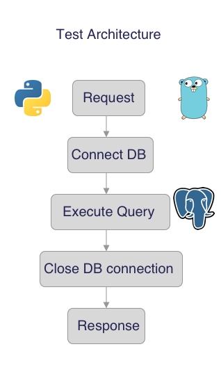

# CRUD-pygo
CRUD comparison between python and golang

CRUD stands for CREATE READ UPDATE DELETE, they are the fundamental operations performed on a database. Read more here [CRUD](https://en.wikipedia.org/wiki/Create,_read,_update_and_delete)
## Architecture

For python, the REST APIs are powered by flask and the GO REST APIs are powered by mux